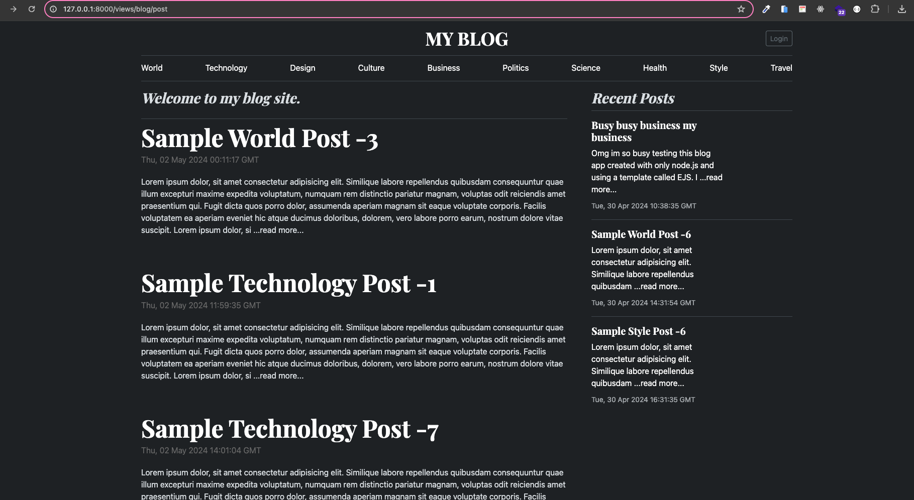

# Blog Website API
This project is a blog site developed using **Node.js** on the backend and **EJS** as the view tamplate.
Users can register and share their articles. Users have the option to save their articles as drafts or publish them directly. They can visit their profiles to edit, delete, or publish their written articles. Additionally, users can comment on and like the published articles. **CRUD** operations are built with a special Node.js Framework.

## Screenshots

<br><br>


## Project Skeleton

```
CactusInk Blog (folder)
|
|
├── public
│    └── assets
│    │    └──  bs
│    │          └── css
│    │          └── js
│    │    └──  js
│    │         └── color-modes.js
│    │    └──  blog.css
│    └── includes
│    │    └──  footer.ejs
│    │    └──  header.ejs
│    └── error.ejs
│    └── index.ejs
│    └── loginForm.ejs
│    └── postForm.ejs
│    └── postRead.ejs
├── src
│    ├── controllers
│    │    └──  api
│    │    └──  views
│    ├── helpers
│    │     ├── passwordEncrypt.js
│    ├── middlewares
│    │     ├──findSearchSortPage.js
│    ├── models
│    │     ├──blogModel.js
│    │     └──userModel.jsx
│    ├── routes
│    │     ├── api
│    │     └── views
│    ├── dbConnection.js
│    ├── errorHandler.js
│    ├── sync.js
├── .env
├── .gitignore
├── EJS-blog-app.png
├── index.js
├── package-lock-json
├── package.json
└── README.md
```

## Tools used;
- **Node.js**: JavaScript runtime for server-side execution.
- **Express**: Minimal and flexible Node.js web framework.
- **Mongoose**: ODM library for MongoDB and Node.js.
- **EJS**: Simple templating language for generating HTML with JavaScript.
